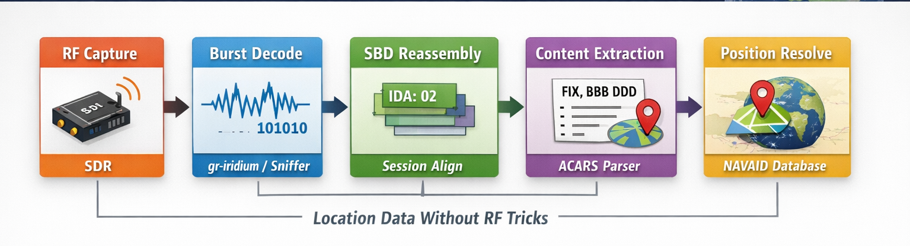
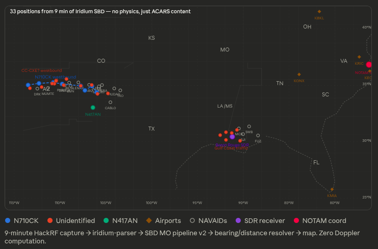

# 📡 Passive Aircraft Geolocation from Iridium ACARS

**Extract aircraft positions from Iridium SBD messages — no RF physics required**

---

## 🚀 What This Is

This project demonstrates a method for **passively geolocating aircraft** by analyzing the *semantic content* of ACARS messages transmitted over **Iridium Short Burst Data (SBD)**.

Instead of using Doppler, multilateration, or satellite ephemeris…

> **We read what the aircraft is already telling us.**

---

## 🔥 Key Result

From a **9-minute SDR capture**:

- ✈️ 33 aircraft position fixes (~1–5 NM accuracy)
- 🧾 48 aircraft identified
- 🧭 7 route segments reconstructed
- 📍 Direct lat/lon extracted from NOTAM
- 🌦️ Weather + operational data decoded  
- ⚡ **Zero physics-based computation**

---

## 🧠 Core Insight

Iridium + ACARS already carries **position-bearing information**:

- Waypoint + bearing + distance (`FIX,BBBDDD`)
- ADS-C position reports (planned)
- REQPOS responses (lat/lon)
- Airport + weather references

➡️ The standard tools decode the message  
➡️ **This pipeline interprets what it means**

---

## 🏗️ Pipeline Overview



```
RF Capture → Burst Decode → SBD Reassembly → Content Extraction → Position Resolution
```

---

## 🗺️ Navigation Database

This project includes a **full FAA navigation database**:

- ~100,000+ fixes and NAVAIDs
- VOR / VORTAC / NDB / intersections
- Enables near-complete waypoint resolution

### 📌 Data Attribution

The navigation dataset is derived from publicly available FAA aeronautical data (CIFP and related sources).

- Source: FAA (Federal Aviation Administration)
- Format: Parsed into JSON for fast lookup
- Use: Waypoint → coordinate resolution

This repository includes a processed subset suitable for geolocation purposes.

---

## ⚙️ Requirements

### Hardware
- HackRF One / Airspy R2 (or similar)
- L-band antenna + LNA recommended

### Software
- gr-iridium
- iridium-sniffer
- iridium-toolkit
- Python 3 (no external dependencies)

---

## ▶️ Quick Start

```bash
iridium-sniffer ... | python3 iridium-parser.py   | tee output.parsed   | python3 reassembler.py -m acars > output.acars

grep 'IDA:.*UL' output.parsed > output_parsed.ul

python3 sbd_mo_pipeline_v2.py output_parsed.ul
```

---

## 🧪 Example Output

Sample run from the v2 pipeline using a synthetic test dataset:

```text
SBD MO Pipeline v2
  UL IDA frames     : 66
  NAVAID database   : 73540 fixes loaded
  Sessions          : 25

  Content extraction:
    Aircraft registrations : 12
    Geographic coordinates : 1
    Waypoint routes        : 4
      Resolved positions   : 9
    NMEA sentences         : 0
    METAR/TAF/NOTAM/PIREP  : 3
    REQPOS requests        : 1
    Performance data       : 0
    Freetext messages      : 9
```

### Example: waypoint route extraction


Westbound track reconstructed from ACARS waypoint reports (N710CK) using Iridium SBD data.

```text
Session 00001  [multi]  2026-04-05 19:00:00 UTC
  Aircraft  : N710CK
  ACARS Lbl : H1
  Route     : MDZUN(282/046) → PYRIT(283/046) → MUMTE(298/054) → DRK(291/053)
```

### Example: direct coordinate from NOTAM

```text
Session 00004
  *** POSITION: 36.827889°, -76.251806°
  NOTAM OBST LT 364940.40N0761506.5W TWR CRANE
```

### Example: freetext / operational message

```text
Session 00007
  "Alrighty I hope he approves of it, would be a bummer to drive it all the way back"
```

---

## 📊 What Gets Extracted

- ✈️ Aircraft registrations
- 🧭 Waypoint routes (H1 position reports)
- 📍 Geographic coordinates (NOTAM, ADS-C)
- 📡 REQPOS requests/responses
- 🌦️ METAR / TAF / NOTAM / PIREP
- 🛬 Performance data
- 💬 Freetext / dispatch messages

---

## 🆚 Comparison

| Feature | iridium-toolkit | This Pipeline |
|--------|----------------|--------------|
| ACARS decode | ✅ | ✅ |
| Payload interpretation | ❌ | ✅ |
| Aircraft position | ❌ | ✅ |
| Accuracy | N/A | ~1–5 NM |

---

## ⚠️ Limitations

- ADS-C extraction not yet implemented
- UL/DL direction not tracked
- Registration correlation incomplete
- Track stitching across sessions is limited

---

## 🛣️ Roadmap

- [ ] ADS-C decoding (libacars integration)
- [ ] UL/DL direction tagging
- [ ] Temporal track stitching
- [ ] Satellite footprint fusion
- [ ] iridium-toolkit plugin mode (`-m geo`)
- [ ] Optional real-time visualization integration

---

## 💡 Philosophy

> Signals carry data  
> Data carries meaning  
> Meaning carries location  

---

## 📜 License

MIT License

---

## 📣 Author

**Mike Brown (@ElbaSatGuy)**

---
